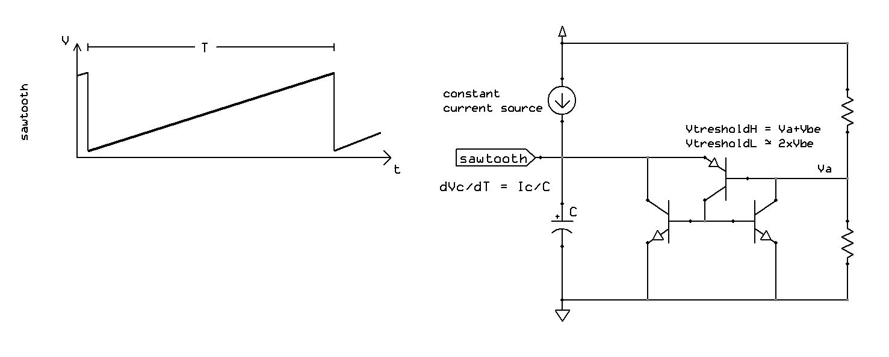
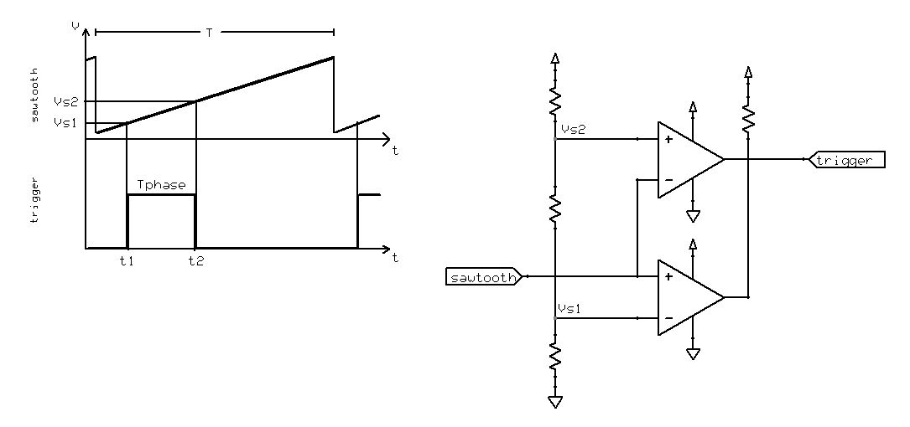
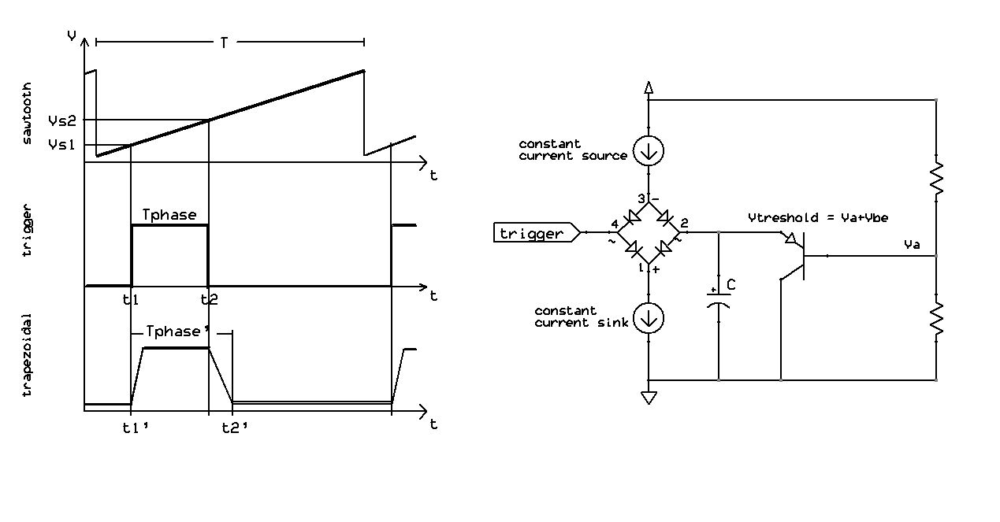
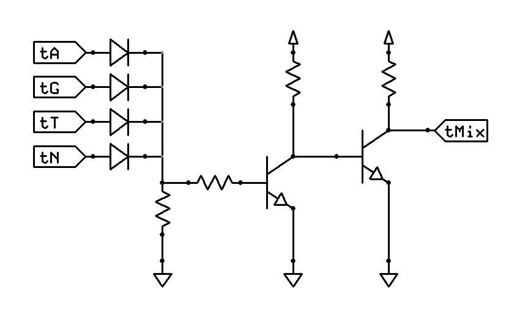
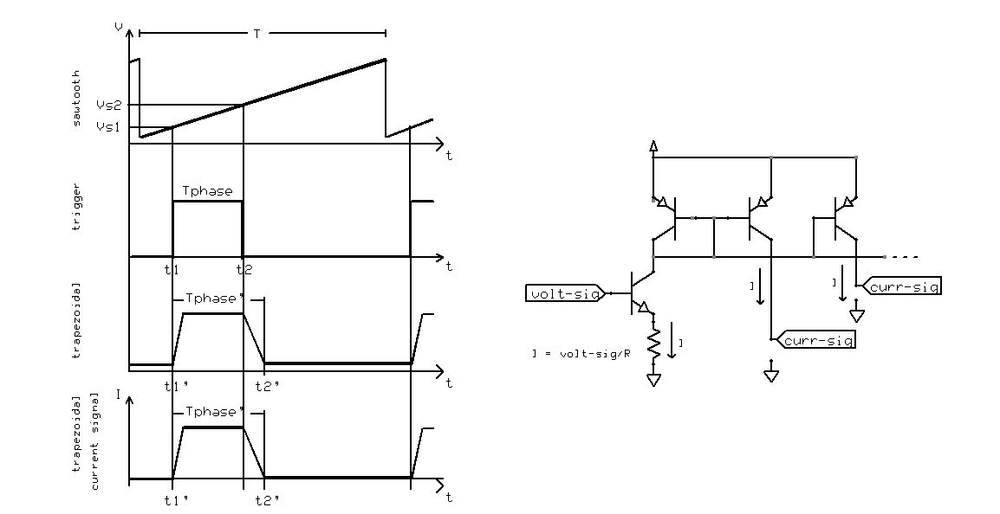

# xpPresepe - Presepe lights-controller eXPerience
A modular control unit for the lighting of the crib (nativity scene).

The idea was to make a light controller with the following specs:
- No MCU or digital ICs, only use of analog components
- Modular approach via BUS
- Power voltage supply between 12 and 24 VDC, with no effects on timings and thresholds
- Simulation of the phases of the day: sunrise, day, sunset, night
- Fade in/out effect on the output lines
- Tremolo effect of the stars light
- Fire-light effect simulation
- Driving of low-current led strings, synchronized with phases of the day or a mixture of them

## Logical Modules

### Sawtooth wave generator
A signal that rises linearly, whose frequency corresponds to the whole day-presepe.
To produce the ramp a constant current generator is used, which linearly charges a capacitor.
To stop the ramp rise a comparator with hysteresis regulates the maximum charge voltage of the capacitor, and the relative discharge.

### Daily-phase triggers generator
Passing the ramp signal through 4 voltage window-comparators, the ramp is divided into 4 sub-periods,
from which to obtain the 4 trigger hi-lo signals of the related phases of the day-presepe: rise, day, sunset, night.

### LFO square wave generator
An astable multivibrator that acts as intermittence, in order to simulate the tremolo of the stars light.

### The BUS
The BUS has the following lines:
* Power lines :
	* +Vcc
	* Gnd
* Phase Triggers lines :
	* tA - sunrise-phase trigger
	* tG - day-phase  trigger
	* tT - sunset-phase trigger
	* tN - night-phase trigger
* Wave lines :
	* S - sawtooth wave
	* lfo - 15Hz square wave

Signals on BUS are buffered to increase the fan-out.

### Daily-Phase light fade in/out effects
Gradually turns on and off the led strings linked to a phase of the day-presepe.
A current-source generator is used to charge a capacitor, the charge value is controlled by a voltage comparator and the phase-trigger signal.
When the trigger is deactivated, by means of a switch diode  network, the capacitor discharges on a current-sink generator
(the trigger signal, when low, must be capable of sink current to GND to activate the diode network).
Starting from a rectangular trigger signal, a trapezoid-shaped voltage signal is obtained as output.

### Trigger Mixer
Mix the trigger signals to obtain compound phases (rise+day, or rise+day+sunset, or rise and sunset, ...).
A diode or-gate is used to mix the triggers, and a level shifter stage maintains the low-signal near GND.

### Voltage to current converter
A current signal is required to drive LED strings. An emitter-follower and current mirrors serve as a converter and line doubler.
The trapezoid-shaped voltage signal is transformed into a trapezoid-shaped current signal.

### Stars-light effect
Mixing toghether the trapezoidal and lfo voltage signals, the result is a serrated signal that emulates the tremolo of the stars light.

### Fire-light effect
todo

## Physical Boards

### Waves board
[waves-board](waves-board) implements the sawtooth wave generator and the lfo generator.

### Triggers board
[triggers-board](triggers-board) implements the daily-phase triggers generator.

### Backplane Board
[backplane-board](backplane-board) the BUS backplane with 7 slots for line boards.
 
### Daily-Phases Lines Board
[phases-lines-board](phases-lines-board) implements quad current driven output lines, configurable fade in/out effect,
synchronization with phase-triggers or a mixture of them, and tremolo effect.

### Fire-lights Lines Board
todo

## About
Author : Alessandro Fraschetti (mail: [gos95@gommagomma.net](mailto:gos95@gommagomma.net))

## Credits:
*w2aew* and his fantastic [tutorials](https://www.youtube.com/channel/UCiqd3GLTluk2s_IBt7p_LjA)

## Licence
The [MIT license](LICENSE) posted in the main repository directory is applied to all the eXPerience stuff.
You are free to use them for any purpose, just try to give credit in the documentation of your project.