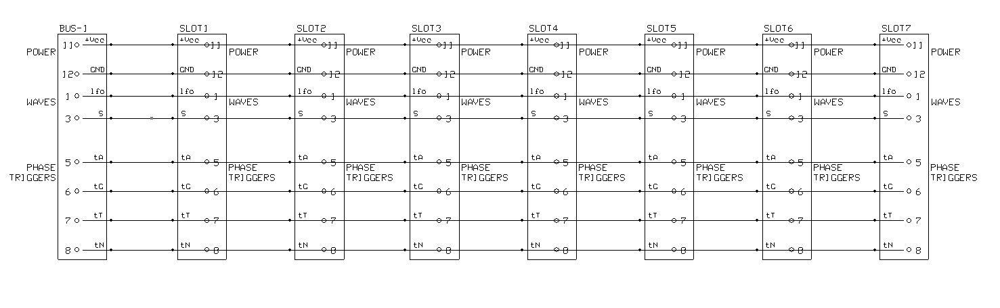
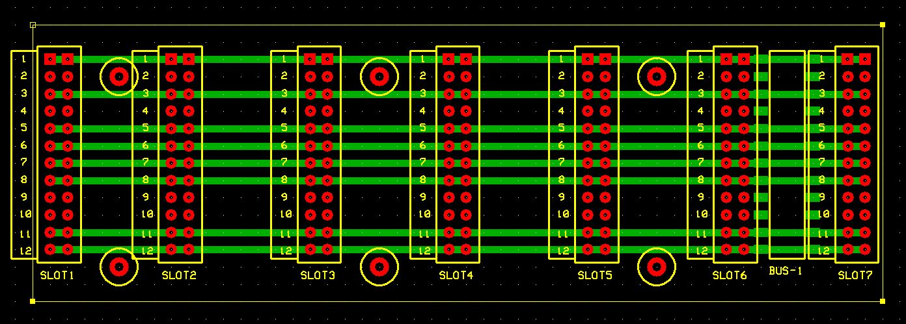

# *Backplane* Board
BUS backplane with 7 slots for line boards.

## Schematic

## PCB Layout

## Bill of Materials
- [x] paperboard 15x9cm cropped to 47x15M (1M=.1inches)
- [x] 7 x DIL 12-pin female header
- [x] DIL 12-pin female header smd