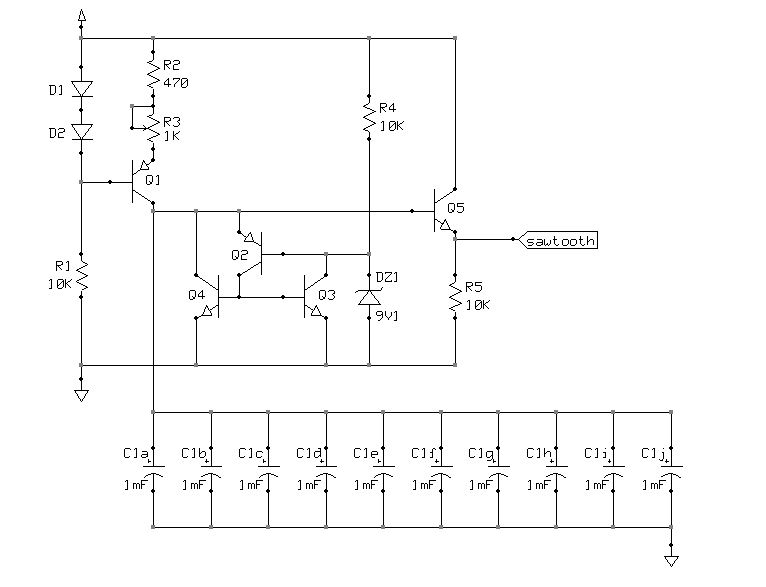
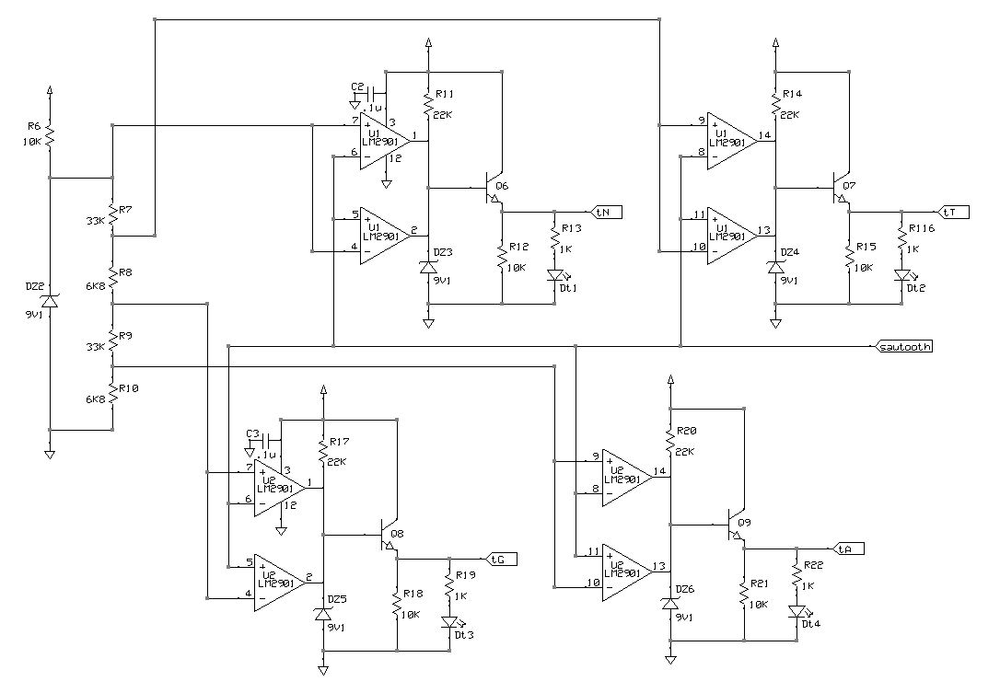
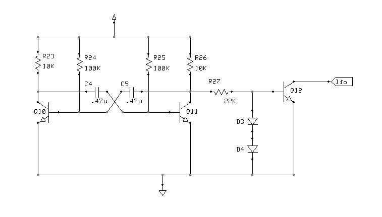

# *Main* Board
Sawtooth wave generator, daily-phase triggers generator and lfo generator.

## Schematic
### sawtooth generator

### triggers generator

### lfo generator

## PCB Layout

## Bill of Materials
- [x] paperboard 15x9cm cropped to 52x15M (1M=.1inches)
- [x] DIL 12-pin header
- [x] 27 x resistor (2 x 100Kohm, 2 x 33Kohm, 5 x 22Kohm, 10 x 10Kohm, 2 x 6K8ohm, 4 x 1Kohm, 1 x 470ohm)
- [x] potentiometer 1Kohm
- [x] 14 x capacitor (10 x 1000uF, 2 x 470nF, 2x100nF)
- [x] 2 x LM2901 quad comparator
- [x] 6 x 9V1 zener diode for small signal
- [x] 4 x diode for small signal (1N4148 or equivalent)
- [x] 12 x transistor for small signal (10 x NPN = BC546, 2 x PNP = BC556 or equivalent)