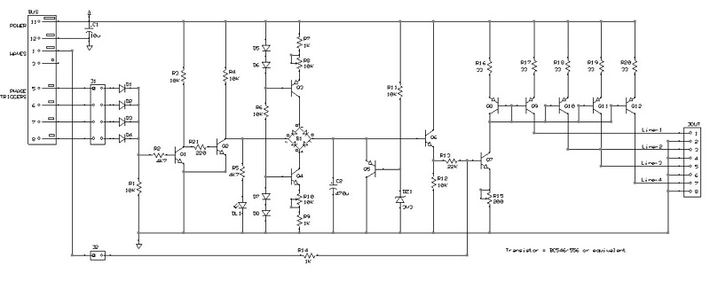
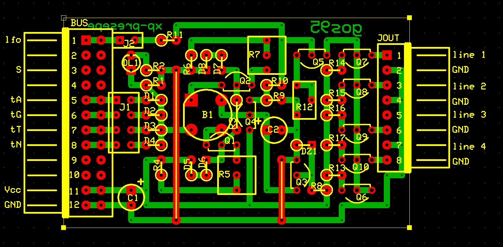

# *Phases Lines* Board
Quad current driven output lines, featuring:
- fade in/out effect, configurable by R8 (fade-in) and R10 (fade-out)
- synchronization with phase-triggers or a mixture of them, by jumpers J1
- tremolo effect, selectable by jumper J2

## Schematic

## PCB Layout

## Bill of Materials
- [x] paperboard 5x7cm cropped to 26x14M (1M=.1inches)
- [x] 1 x bulk capacitor 10uF 35V
- [x] trigger activity led green 3mm
- [x] led current limiter resistor 4K7ohm
- [x] DIL 12-pin right-angle header
- [x] SIL 8-pin right-angle header
- [x] 5 x 2-pin header jumper
- [x] 16 x resistor 1/4 watt (1 x 22Kohm, 6 x 10Kohm, 2 x 4K7ohm, 3 x 1Kohm, 1 x 220ohm, 5 x 33ohm)
- [x] 3 x resistive trimmer (2 x 10Kohm, 1 x 200ohm)
- [x] 1 x capacitor 470uF 16V
- [x] 1 x diode bridge for very small voltage and current
- [x] 9 x diode for small signal
- [x] 12 x transistor for small signal (5 x NPN = BC546, 7 x PNP = BC556 or equivalent)