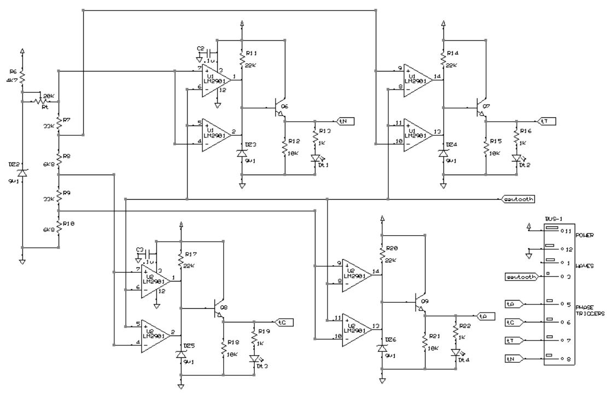
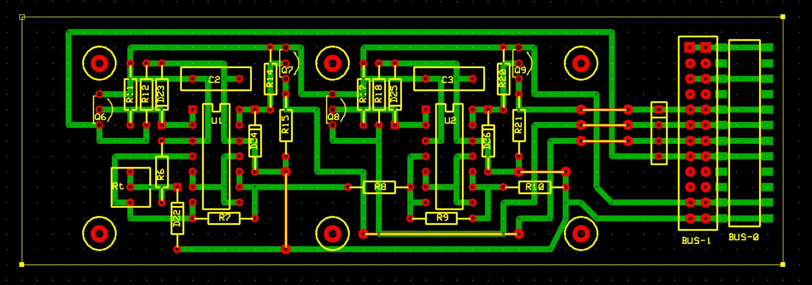

# *Triggers* Board
Daily-phase triggers generator.

## Schematic

## PCB Layout

## Bill of Materials
- [x] paperboard 15x9cm cropped to 50x15M (1M=.1inches)
- [x] DIL 12-pin header
- [x] DIL 12-pin female header smd
- [x] 13 x resistor (2 x 33Kohm, 4 x 22Kohm, 4 x 10Kohm, 2 x 6K8ohm, 1 x 4K7ohm)
- [x] trimmer 20Kohm
- [x] 2 x capacitor 100nF
- [x] 2 x LM2901 quad comparator
- [x] 5 x 9V1 zener diode for small signal
- [x] 4 x NPN transistor for small signal (BC546 or equivalent)