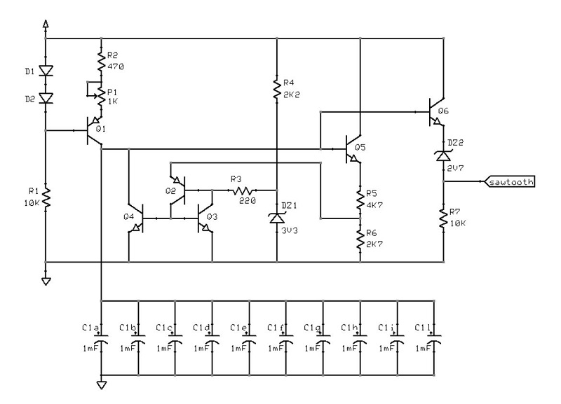
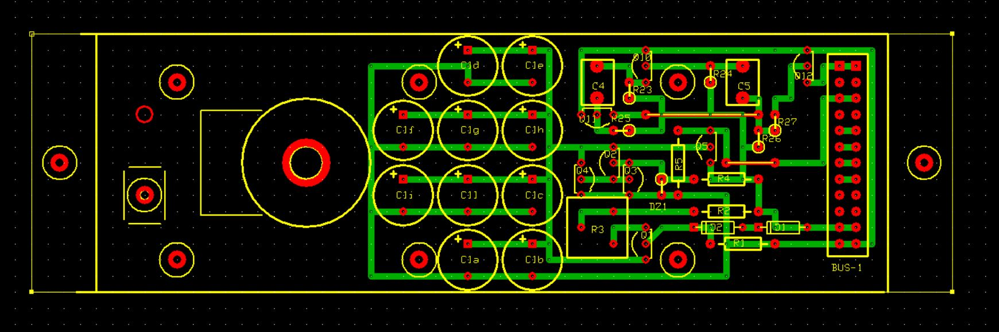

# *Waves* Board
Sawtooth wave generator and lfo generator.

## Schematic
### sawtooth generator

### lfo generator

## PCB Layout

## Bill of Materials
- [x] paperboard 15x9cm cropped to 58x15M (1M=.1inches)
- [x] DIL 12-pin header
- [x] 8 x resistors (2 x 100Kohm, 5 x 10Kohm, 1 x 4K7ohm, 1 x 2K7 ohm, 1 x 2K2ohm, 1 x 470ohm, 1 x 220ohm)
- [x] potentiometer 1Kohm
- [x] 12 x capacitors (10 x 1000uF, 2 x 470nF)
- [x] 3V3 and 2V7 zener diodes for small signal
- [x] 4 x diodes for small signal (1N4148 or equivalent)
- [x] 8 x transistors for small signal (7 x NPN = BC546/2N3904, 2 x PNP = BC556/2N3906 or equivalent)